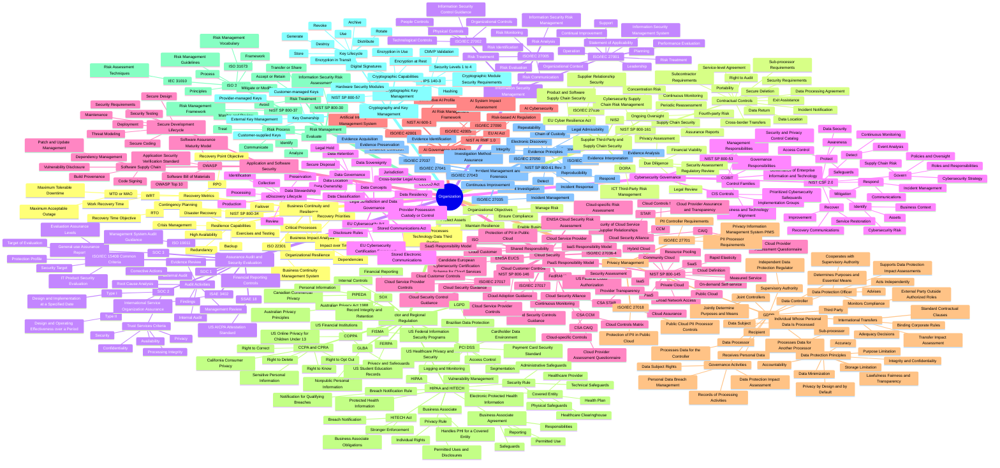

# Cybersecurity Standards, Frameworks & Regulations

```mermaid
mindmap
  root((Organization))
    People Processes Technology Data Third Parties
    Organizational Objectives
      Manage Risk
      Protect Assets
      Ensure Compliance
      Maintain Resilience
      Enable Business
    Information Security Management
      ISO/IEC 27001
        Information Security Management System
        Organizational Context
        Leadership
        Planning
        Support
        Operation
        Performance Evaluation
        Continual Improvement
        Risk Treatment
        Statement of Applicability
      ISO/IEC 27002
        Information Security Control Guidance
        Organizational Controls
        People Controls
        Physical Controls
        Technological Controls
      ISO/IEC 27005
        Information Security Risk Management
        Risk Identification
        Risk Analysis
        Risk Evaluation
        Risk Treatment
        Risk Monitoring
        Risk Communication
    Cybersecurity Governance
      NIST CSF 2.0
        Govern
          Cybersecurity Strategy
          Policies and Oversight
          Roles and Responsibilities
          Supply Chain Risk
        Identify
          Assets
          Business Context
          Cybersecurity Risk
        Protect
          Safeguards
          Access Control
          Data Security
          Awareness
        Detect
          Continuous Monitoring
          Event Analysis
        Respond
          Incident Management
          Communications
          Mitigation
        Recover
          Service Restoration
          Recovery Communications
          Improvement
      COBIT
        Governance of Enterprise Information and Technology
        Business and Technology Alignment
        Governance Responsibilities
        Management Responsibilities
      CIS Controls
        Prioritized Cybersecurity Safeguards
        Implementation Groups
      NIST SP 800-53
        Security and Privacy Control Catalog
        Control Families
    Cloud Security
      ISO/IEC 27017
        Cloud Security Controls Guidance
        Cloud Customer Controls
        Cloud Service Provider Controls
      ISO/IEC 27018
        Protection of PII in Public Cloud
      ISO/IEC 27036-4
        Security of Cloud Service Supplier Relationships
      Cloud Security Alliance
        CCM
          Cloud Controls Matrix
        CAIQ
          Cloud Provider Assessment Questionnaire
        STAR
          Cloud Provider Assurance and Transparency
      FedRAMP
        US Federal Cloud Authorization
        Security Assessment
        Continuous Monitoring
      ENISA Cloud Security Risk Assessment
        Cloud-specific Risk Assessment
      ENISA EUCS
        Candidate European Cybersecurity Certification Scheme for Cloud Services
      NIST SP 800-145
        Cloud Definition
        On-demand Self-service
        Broad Network Access
        Resource Pooling
        Rapid Elasticity
        Measured Service
        SaaS
        PaaS
        IaaS
        Public Cloud
        Private Cloud
        Community Cloud
        Hybrid Cloud
      NIST SP 800-146
        Cloud Adoption Guidance
        Cloud Security Guidance
      ISO/IEC 27017
        Cloud Security Control Guidance
        Cloud Customer Controls
        Cloud Service Provider Controls
      Cloud Security Alliance
        CSA CCM
          Cloud Controls Matrix
          Cloud-specific Controls
        CSA CAIQ
          Cloud Provider Assessment Questionnaire
        CSA STAR
          Cloud Assurance
          Provider Transparency
      Shared Responsibility
        Cloud Service Provider
        Cloud Customer
        SaaS Responsibility Model
        PaaS Responsibility Model
        IaaS Responsibility Model
    AI Governance and Risk
      ISO/IEC 42001
        Artificial Intelligence Management System
      NIST AI RMF 1.0
        AI Risk Management Framework
      NIST AI 600-1
        Generative AI Profile
      ISO/IEC 42005
        AI System Impact Assessment
      EU AI Act
        Risk-based AI Regulation
      ISO/IEC 27090
        AI Cybersecurity
    Privacy Management
      ISO/IEC 27701
        Privacy Information Management System PIMS
        PII Controller Requirements
        PII Processor Requirements
      ISO/IEC 27018
        Protection of PII in Public Cloud
        Public Cloud PII Processor Controls
      GDPR
        Data Subject
          Individual Whose Personal Data Is Processed
        Data Controller
          Determines Purposes and Essential Means
        Joint Controllers
          Jointly Determine Purposes and Means
        Data Processor
          Processes Data for the Controller
        Sub-processor
          Processes Data for Another Processor
        Data Protection Officer
          Advises
          Monitors Compliance
          Supports Data Protection Impact Assessments
          Cooperates with Supervisory Authority
          Acts Independently
        Supervisory Authority
          Independent Data Protection Regulator
        Recipient
          Receives Personal Data
        Third Party
          External Party Outside Authorized Roles
        Data Protection Principles
          Lawfulness Fairness and Transparency
          Purpose Limitation
          Data Minimization
          Accuracy
          Storage Limitation
          Integrity and Confidentiality
          Accountability
          Privacy by Design and by Default
        Governance Activities
          Records of Processing Activities
          Data Protection Impact Assessment
          Data Subject Rights
          Personal Data Breach Management
        International Transfers
          Adequacy Decisions
          Standard Contractual Clauses
          Binding Corporate Rules
          Transfer Impact Assessment
    Sector and Regional Regulation
      HIPAA and HITECH
        HIPAA
          US Healthcare Privacy and Security
        Protected Health Information
        Electronic Protected Health Information
        Covered Entity
          Healthcare Provider
          Health Plan
          Healthcare Clearinghouse
        Business Associate
          Handles PHI for a Covered Entity
        Privacy Rule
          Permitted Uses and Disclosures
          Individual Rights
        Security Rule
          Administrative Safeguards
          Physical Safeguards
          Technical Safeguards
        Breach Notification Rule
          Notification for Qualifying Breaches
        HITECH Act
          Stronger Enforcement
          Breach Notification
          Business Associate Obligations
        Business Associate Agreement
          Permitted Use
          Safeguards
          Reporting
          Responsibilities
      GLBA
        US Financial Institutions
        Nonpublic Personal Information
        Privacy and Safeguards
      PIPEDA
        Canadian Commercial Privacy
        Personal Information
      Australian Privacy Act 1988
        Australian Privacy Principles
      CCPA and CPRA
        California Consumer Privacy
        Right to Know
        Right to Delete
        Right to Correct
        Right to Opt Out
        Sensitive Personal Information
      LGPD
        Brazilian Data Protection
      COPPA
        US Online Privacy for Children Under 13
      FERPA
        US Student Education Records
      SOX
        Financial Reporting
        Internal Controls
        Record Integrity and Retention
      FISMA
        US Federal Information Security Programs
      PCI DSS
        Payment Card Security Standard
        Cardholder Data Environment
        Segmentation
        Access Control
        Logging and Monitoring
        Vulnerability Management
    Risk Management
      ISO 31000
        Risk Management Guidelines
        IEC 31010
          Risk Assessment Techniques
        ISO 31073
          Risk Management Vocabulary
        Principles
        Framework
        Process
      NIST SP 800-30
        Information Security Risk Assessment
      NIST SP 800-37
        Risk Management Framework
      Risk Process
        Identify
        Analyze
        Evaluate
        Treat
        Monitor and Review
        Communicate
      Risk Treatment
        Avoid
        Mitigate or Modify
        Transfer or Share
        Accept or Retain
    Cryptography and Key Management
      FIPS 140-3
        Cryptographic Module Security Requirements
        CMVP Validation
        Security Levels 1 to 4
      NIST SP 800-57
        Cryptographic Key Management
      Key Lifecycle
        Generate
        Store
        Distribute
        Use
        Rotate
        Revoke
        Archive
        Destroy
      Key Ownership
        Provider-managed Keys
        Customer-managed Keys
        Customer-supplied Keys
        External Key Management
      Cryptographic Capabilities
        Encryption at Rest
        Encryption in Transit
        Encryption in Use
        Hashing
        Digital Signatures
        Hardware Security Modules
    Incident Management and Forensics
      ISO/IEC 27035
        Incident Management
      ISO/IEC 27037
        Evidence Identification
        Evidence Collection
        Evidence Acquisition
        Evidence Preservation
      ISO/IEC 27041
        Investigation Method Assurance
      ISO/IEC 27042
        Evidence Analysis
        Evidence Interpretation
      ISO/IEC 27043
        Incident Investigation
      ISO/IEC 27050
        Electronic Discovery
      NIST SP 800-61 Rev. 3
        Incident Response
        Detect
        Respond
        Recover
        Continuous Improvement
      Evidence Principles
        Chain of Custody
        Integrity
        Repeatability
        Reproducibility
        Legal Admissibility
    Business Continuity and Resilience
      ISO 22301
        Business Continuity Management System
        Organizational Resilience
      NIST SP 800-34
        Contingency Planning
      Business Impact Analysis
        Critical Processes
        Dependencies
        Impact over Time
        Recovery Priorities
      Recovery Metrics
        MTD or MAO
          Maximum Tolerable Downtime
          Maximum Acceptable Outage
        RTO
          Recovery Time Objective
        RPO
          Recovery Point Objective
        WRT
          Work Recovery Time
      Resilience Capabilities
        Backup
        Redundancy
        High Availability
        Failover
        Disaster Recovery
        Crisis Management
        Exercises and Testing
    Supplier Third-Party and Supply Chain Security
      ISO/IEC 27036
        Supplier Relationship Security
      NIST SP 800-161
        Cybersecurity Supply Chain Risk Management
      NIS2
        Supply Chain Security
      DORA
        ICT Third-Party Risk Management
      EU Cyber Resilience Act
        Product and Software Supply Chain Security
      Due Diligence
        Security Assessment
        Privacy Assessment
        Financial Viability
        Legal Review
        Regulatory Review
      Contractual Controls
        Security Requirements
        Data Processing Agreement
        Service-level Agreement
        Right to Audit
        Incident Notification
        Subcontractor Requirements
        Sub-processor Requirements
        Data Location
        Cross-border Transfers
        Exit Assistance
        Portability
        Data Return
        Secure Deletion
      Ongoing Oversight
        Continuous Monitoring
        Periodic Reassessment
        Assurance Reports
        Concentration Risk
        Fourth-party Risk
    Assurance Audit and Security Evaluation
      SOC 1
        Financial Reporting Controls
      SOC 2
        Trust Services Criteria
          Security
          Availability
          Processing Integrity
          Confidentiality
          Privacy
        Type I
          Design and Implementation at a Specified Date
        Type II
          Design and Operating Effectiveness over a Period
      SOC 3
        General-use Assurance Report
      SSAE 18
        US AICPA Attestation Standard
      ISAE 3402
        International Service Organization Assurance
      ISO 19011
        Management System Audit Guidance
      ISO/IEC 15408 Common Criteria
        IT Product Security Evaluation
        Target of Evaluation
        Protection Profile
        Security Target
        Evaluation Assurance Levels
      Audit Activities
        Internal Audit
        External Audit
        Evidence Review
        Findings
        Root Cause Analysis
        Corrective Actions
        Management Review
    Legal Jurisdiction and Data Governance
      EU Cybersecurity Act
        EU Cybersecurity Certification Framework
      CLOUD Act
        Provider Possession Custody or Control
        Cross-border Legal Access
      Stored Communications Act
        Stored Electronic Communications
        Disclosure Rules
      Data Concepts
        Data Location
        Data Residency
        Data Sovereignty
        Jurisdiction
      Data Governance
        Data Ownership
        Data Stewardship
        Data Classification
        Data Retention
        Legal Hold
        Secure Disposal
      eDiscovery Lifecycle
        Identification
        Preservation
        Collection
        Processing
        Review
        Production
    Application and Software Security
      OWASP
        OWASP Top 10
        Application Security Verification Standard
        Software Assurance Maturity Model
      Secure Development Lifecycle
        Security Requirements
        Threat Modeling
        Secure Design
        Secure Coding
        Security Testing
        Deployment
        Maintenance
      Software Supply Chain
        Software Bill of Materials
        Dependency Management
        Code Signing
        Build Provenance
        Vulnerability Disclosure
        Patch and Update Management
```
