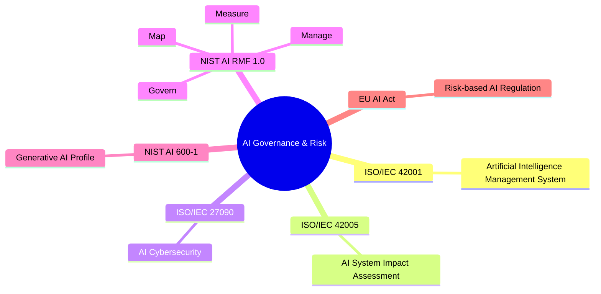

# AI Governance & Risk

```mermaid
mindmap
  root((AI Governance & Risk))
    ISO/IEC 42001
      Artificial Intelligence Management System
    ISO/IEC 42005
      AI System Impact Assessment
    ISO/IEC 27090
      AI Cybersecurity
    NIST AI RMF 1.0
      Govern
      Map
      Measure
      Manage
    NIST AI 600-1
      Generative AI Profile
    EU AI Act
      Risk-based AI Regulation
```

[Back to main map](../README.md)
