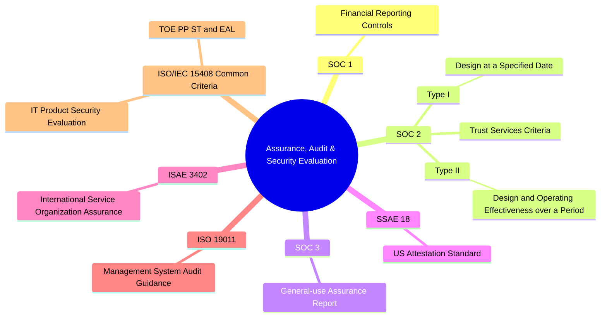

# Assurance, Audit & Security Evaluation

```mermaid
mindmap
  root((Assurance, Audit & Security Evaluation))
    SOC 1
      Financial Reporting Controls
    SOC 2
      Trust Services Criteria
      Type I
        Design at a Specified Date
      Type II
        Design and Operating Effectiveness over a Period
    SOC 3
      General-use Assurance Report
    SSAE 18
      US Attestation Standard
    ISAE 3402
      International Service Organization Assurance
    ISO 19011
      Management System Audit Guidance
    ISO/IEC 15408 Common Criteria
      IT Product Security Evaluation
      TOE PP ST and EAL
```

[Back to main map](../README.md)
