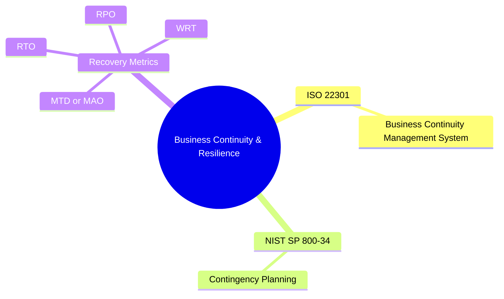

# Business Continuity & Resilience

```mermaid
mindmap
  root((Business Continuity & Resilience))
    ISO 22301
      Business Continuity Management System
    NIST SP 800-34
      Contingency Planning
    Recovery Metrics
      MTD or MAO
      RTO
      RPO
      WRT
```

[Back to main map](../README.md)
