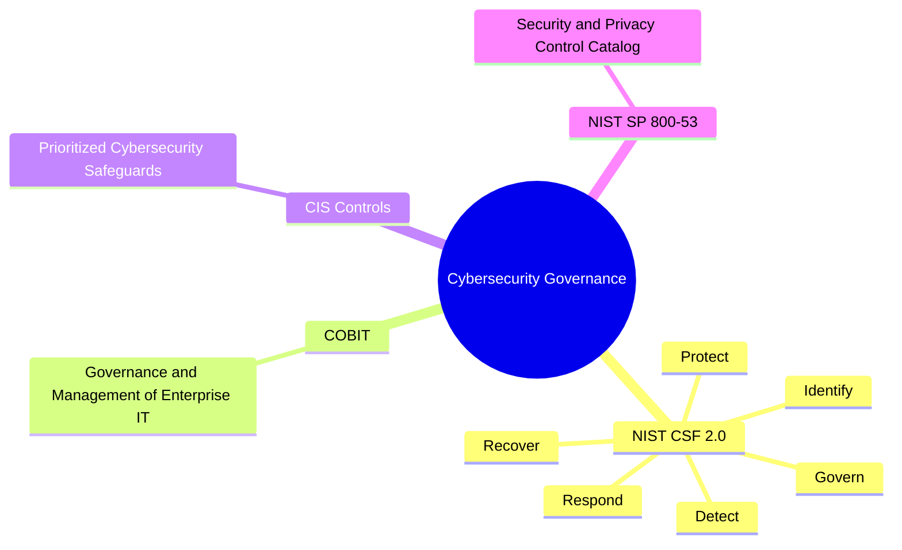

# Cybersecurity Governance

```mermaid
mindmap
  root((Cybersecurity Governance))
    NIST CSF 2.0
      Govern
      Identify
      Protect
      Detect
      Respond
      Recover
    COBIT
      Governance and Management of Enterprise IT
    CIS Controls
      Prioritized Cybersecurity Safeguards
    NIST SP 800-53
      Security and Privacy Control Catalog
```

[Back to main map](../README.md)
