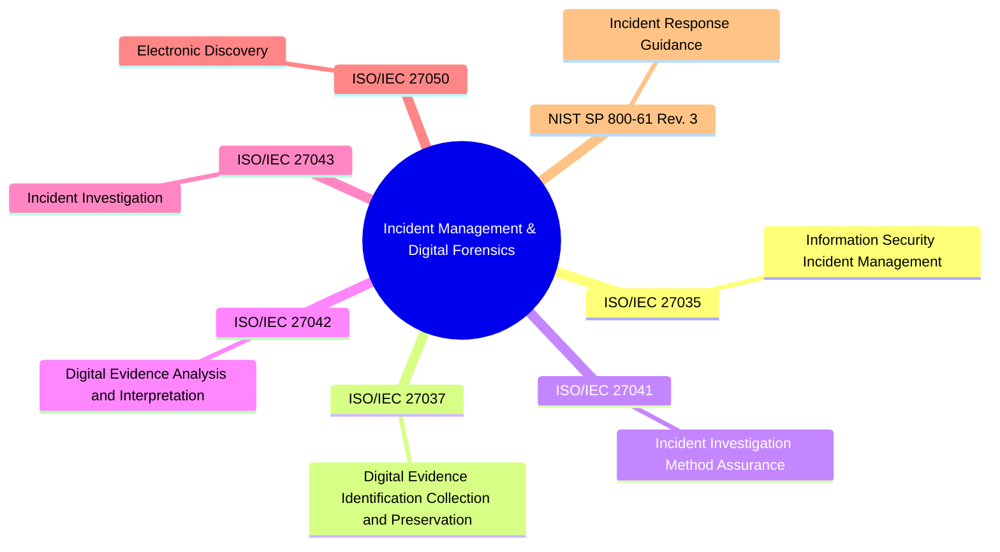

# Incident Management & Digital Forensics

```mermaid
mindmap
  root((Incident Management & Digital Forensics))
    ISO/IEC 27035
      Information Security Incident Management
    ISO/IEC 27037
      Digital Evidence Identification Collection and Preservation
    ISO/IEC 27041
      Incident Investigation Method Assurance
    ISO/IEC 27042
      Digital Evidence Analysis and Interpretation
    ISO/IEC 27043
      Incident Investigation
    ISO/IEC 27050
      Electronic Discovery
    NIST SP 800-61 Rev. 3
      Incident Response Guidance
```

[Back to main map](../README.md)
