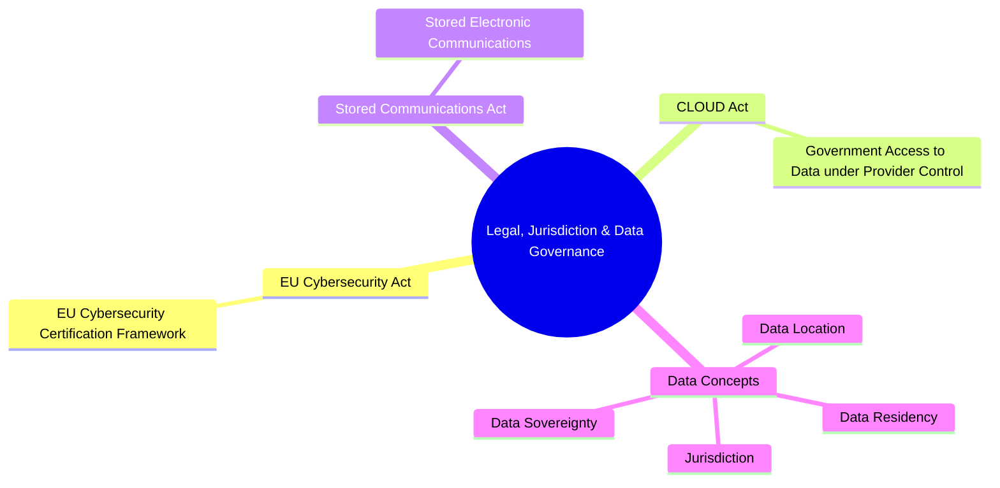

# Legal, Jurisdiction & Data Governance

```mermaid
mindmap
  root((Legal, Jurisdiction & Data Governance))
    EU Cybersecurity Act
      EU Cybersecurity Certification Framework
    CLOUD Act
      Government Access to Data under Provider Control
    Stored Communications Act
      Stored Electronic Communications
    Data Concepts
      Data Location
      Data Residency
      Data Sovereignty
      Jurisdiction
```

[Back to main map](../README.md)
