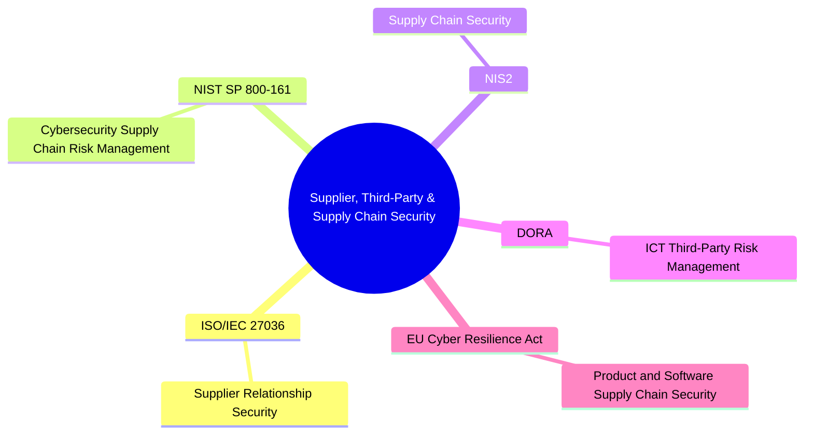

# Supplier, Third-Party & Supply Chain Security

```mermaid
mindmap
  root((Supplier, Third-Party & Supply Chain Security))
    ISO/IEC 27036
      Supplier Relationship Security
    NIST SP 800-161
      Cybersecurity Supply Chain Risk Management
    NIS2
      Supply Chain Security
    DORA
      ICT Third-Party Risk Management
    EU Cyber Resilience Act
      Product and Software Supply Chain Security
```

[Back to main map](../README.md)
